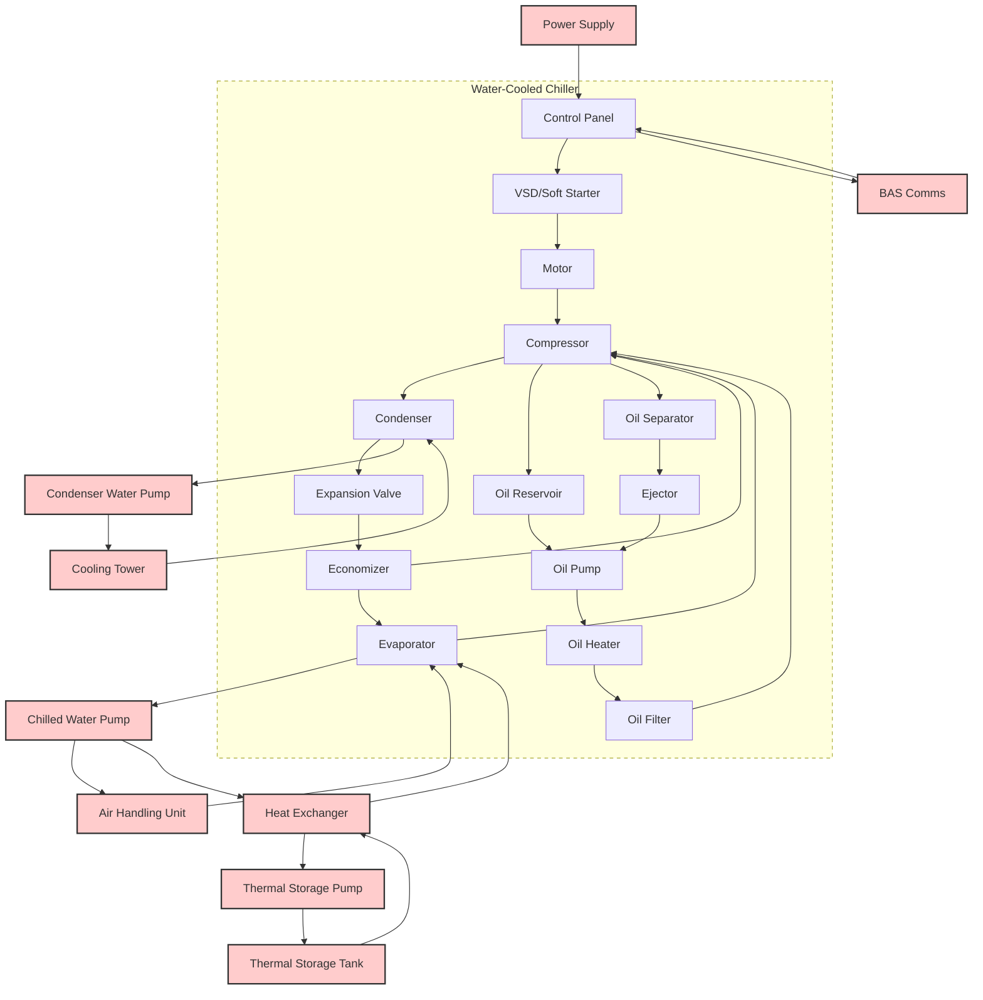
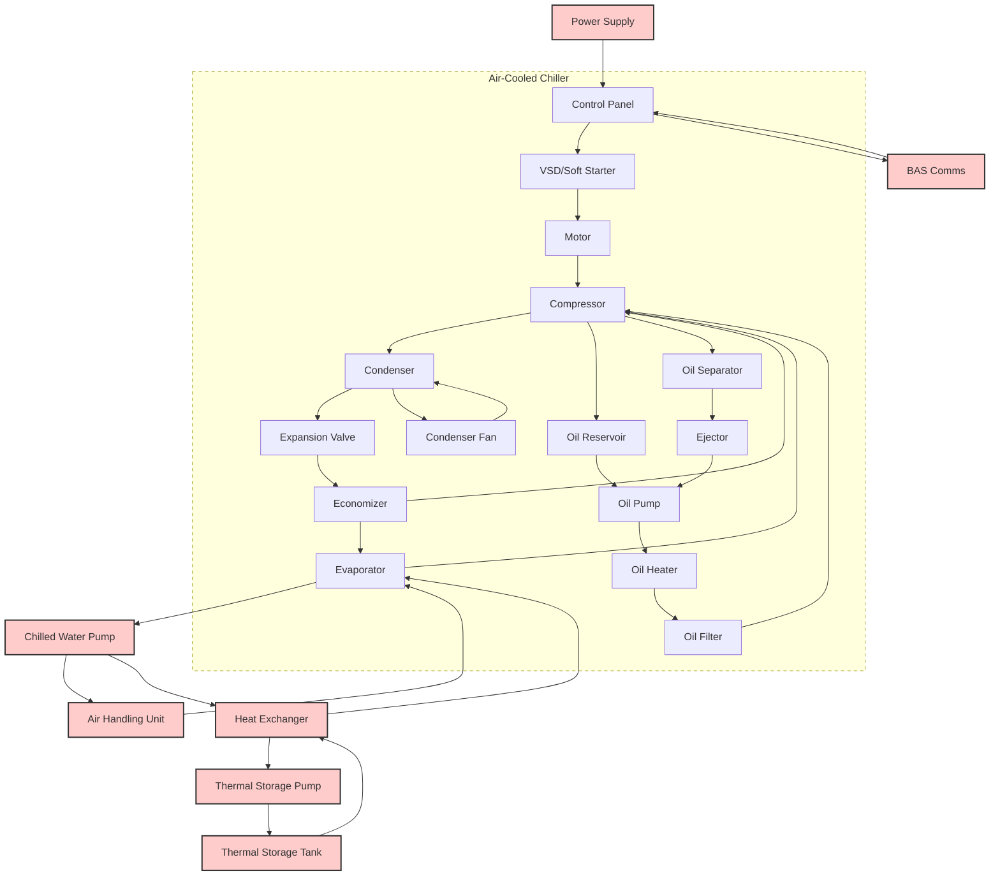

```markdown
# Block Diagram Project

## Overview

This project contains block diagrams for HVAC systems, including Water-Cooled Chiller and Air-Cooled Chiller systems. The diagrams are created using Mermaid syntax to visually represent the components and their connections within these systems.

## Table of Contents

- [Overview](#overview)
- [Block Diagrams](#block-diagrams)
  - [Water-Cooled Chiller Diagram](#water-cooled-chiller-diagram)
  - [Air-Cooled Chiller Diagram](#air-cooled-chiller-diagram)
- [Installation](#installation)
- [Usage](#usage)
- [Contributing](#contributing)
- [License](#license)

## Block Diagrams

### Water-Cooled Chiller Diagram



### Air-Cooled Chiller Diagram



## Installation

1. Clone the repository to your local machine:
    ```sh
    git clone https://github.com/yourusername/block-diagram-project.git
    ```

2. Navigate to the project directory:
    ```sh
    cd block-diagram-project
    ```

## Usage

Open the `README.md` file in any Markdown viewer that supports Mermaid to visualize the block diagrams. You can also use online Mermaid editors such as [Mermaid Live Editor](https://mermaid-js.github.io/mermaid-live-editor/) to view and edit the diagrams.

## Contributing

Contributions are welcome! Please follow these steps to contribute:

1. Fork the repository.
2. Create a new branch: `git checkout -b my-feature-branch`.
3. Make your changes and commit them: `git commit -m 'Add new feature'`.
4. Push to the branch: `git push origin my-feature-branch`.
5. Create a pull request.

## License

This project is licensed under the MIT License. See the [LICENSE](LICENSE) file for details.
```

Feel free to modify the content according to your project's specific requirements and details.
